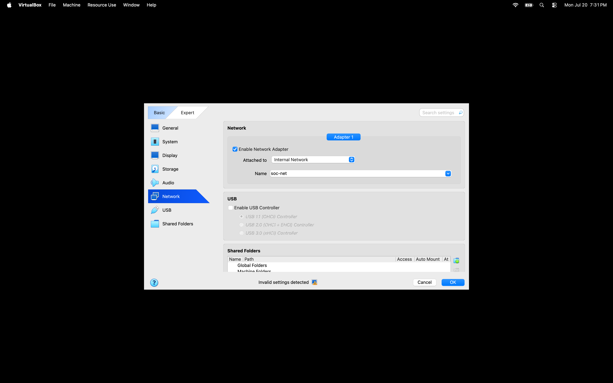
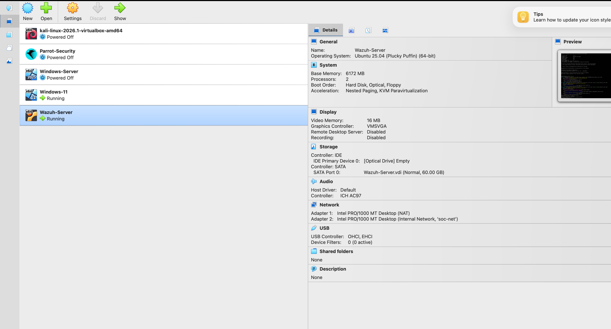

# Phase 1: Virtual Infrastructure & Isolated Network Architecture

## 1. Architectural Objective & Threat Model
The primary objective was to deploy a segregated, virtual security operations environment to safely conduct adversarial simulations, observe live telemetry generation, and validate SIEM alert pipelines without risking production networks or public exposure.

* **Network Containment:** Configured VirtualBox Internal Network (`soc-net`) to eliminate inadvertent outbound traffic or accidental internet routability.
* **Subnet Architecture:** `192.168.10.0/24` non-routable private address space.
* **Core Nodes:**
  * **Adversarial Platform:** Kali Linux (`192.168.10.x`) — Dedicated simulation node for reconnaissance, brute-force, and persistence techniques.
  * **Monitored Endpoint:** Windows 11 Enterprise (`192.168.10.x`) — Workstation configured for granular process, authentication, and network telemetry capture.
  * **Detection Engine:** Wazuh SIEM Server (`192.168.10.x`) — Centralized log ingestion, correlation engine, and alert dashboard.

---

## 2. Infrastructure Deployment & Hypervisor Configuration

To ensure strict network segmentation, all virtual interfaces were decoupled from default NAT/Bridged adapters and assigned to an isolated internal switch.


*Figure 1.1: VirtualBox hypervisor internal network boundary assignment.*


*Figure 1.2: Multi-node lab topology inventory.*

---

## 3. Connectivity Baseline & Network Troubleshooting

### Step 1: Endpoint IP & Subnet Verification
Verified static/DHCP assignments across both hosts to ensure mutual Layer 3 visibility on `192.168.10.0/24`.

* **Kali Linux:**
  ```bash
  ip a show eth0
