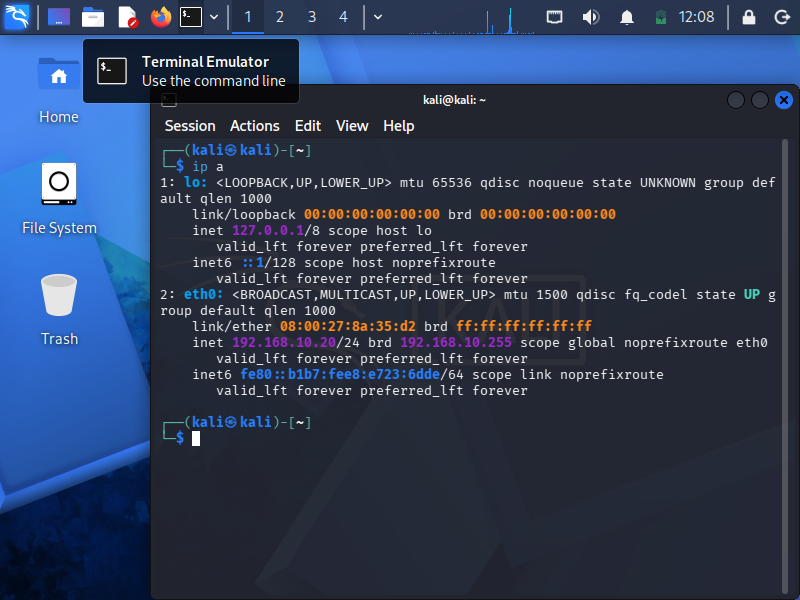

# Phase 1: Infrastructure Deployment

## 1. Objective 
I built an isolated, multi-VM virtual lab network using VirtualBox to safely simulate an enterprise network without exposing the environment to the public internet. This ensures malware or attack simulations stay contained.

* **Subnet Range:** `192.168.10.0/24`
* **Network Mode:** VirtualBox Internal Network `soc-net`

---

## 2. Environment Setup
The lab consists of two primary virtual machines deployed within the isolated subnet:
1. **Windows 11 Pro:** Serving as the target workstation for log collection.
2. **Kali Linux:** Serving as the controlled adversarial platform to launch simulations.

---

## 3. Verification
To confirm the environment was properly isolated and both endpoints had line-of-sight to each other, I verified the IP configurations:

### Hypervisor Network Bounds

### Kali Linux Subnet Verification
