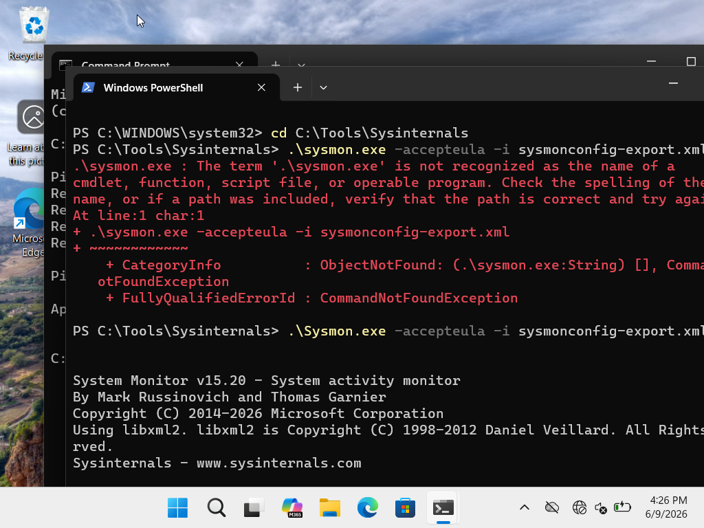
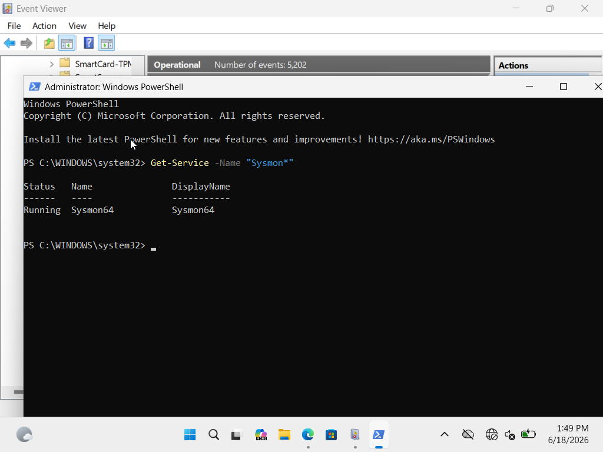
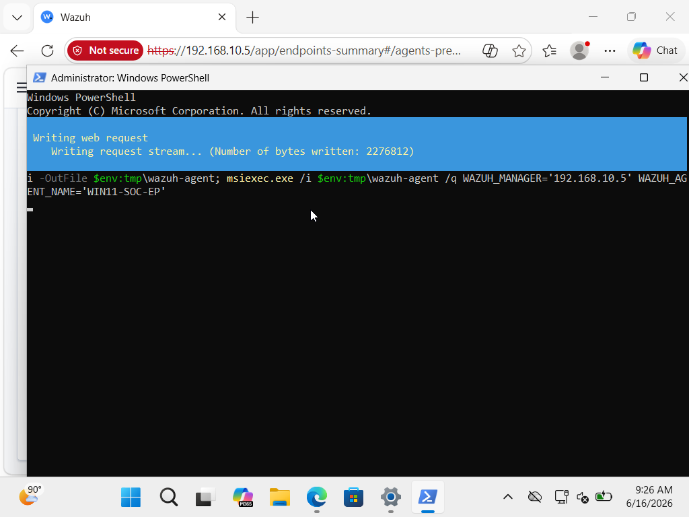
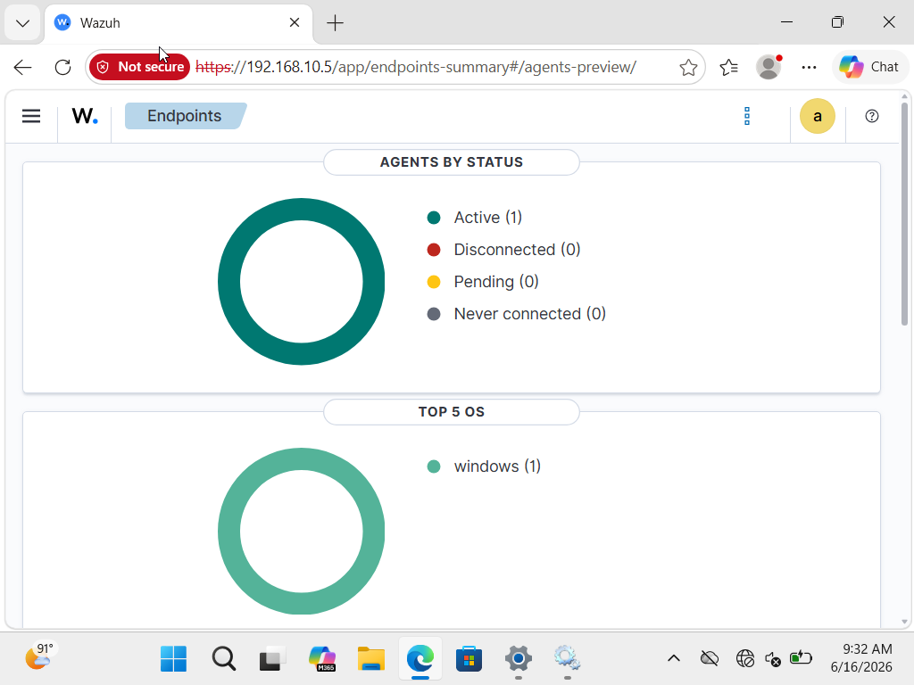
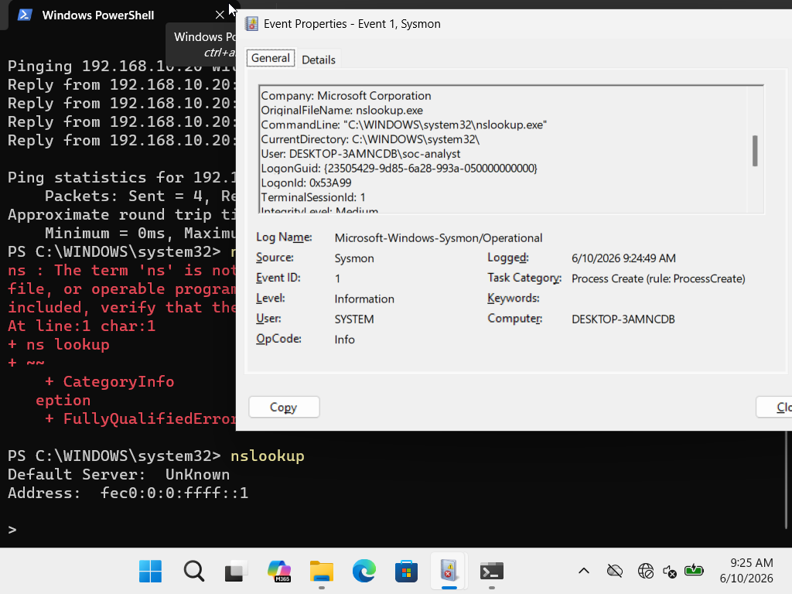
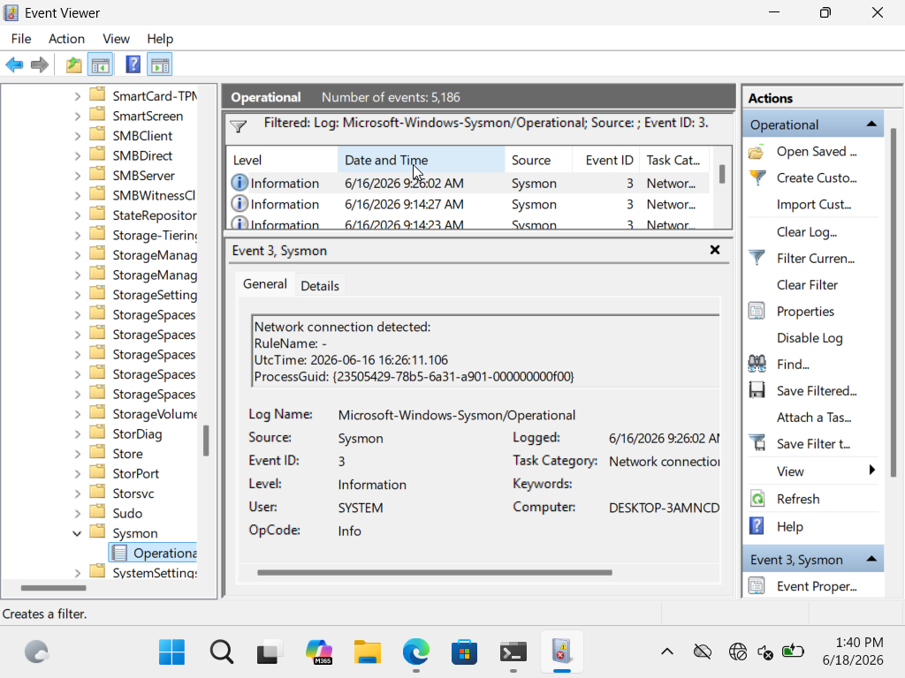

# Phase 2: Telemetry Ingestion, Pipeline Architecture & Endpoint Monitoring

## 1. Objective & Analytical Rationale

Default Windows security event auditing lacks granular visibility into process lineage, memory injection, and command-line execution arguments. The objective of this phase was to construct a high-fidelity endpoint detection pipeline on the Windows 11 workstation and centralize log ingestion into the Wazuh SIEM.

* **The "Why":** Without low-level telemetry, an adversary executing fileless malware or living-off-the-land binaries (`LOLBins`) blends into baseline host activity. Deploying Sysmon bridges the visibility gap between standard Windows Event logs and advanced threat hunting requirements.
* **Pipeline Architecture:** `Windows Event Log / Sysmon` ➡️ `Wazuh Agent (OSSEC Service)` ➡️ `Encrypted Transport (Port 1514 TCP)` ➡️ `Wazuh Manager (Analysis Engine & Elasticsearch/Indexer)`.

---

## 2. Telemetry Configuration & Agent Deployment

### Step 1: Sysmon Instrumentation & Filter Tuning
Installed Microsoft Sysinternals **Sysmon64** using a tailored configuration schema to enrich critical telemetry streams while suppressing high-volume background system noise.

```powershell
# Install and apply baseline schema
.\Sysmon64.exe -i sysmonconfig.xml -accepteula
```


*Figure 2.1: Sysmon64 service initialized and actively driver-hooked into kernel space.*

Verified active operational status via PowerShell service query:

```powershell
Get-Service -Name "Sysmon64"
```


*Figure 2.2: PowerShell verification confirming Sysmon64 service is in a Running state.*

---

### Step 2: Wazuh Agent Deployment & Channel Configuration
Enrolled the Windows 11 endpoint to the centralized Wazuh Manager (`192.168.10.x`) and configured the local `ossec.conf` to monitor the Sysmon operational channel.

```powershell
# Enrolling endpoint agent to manager
.\wazuh-agent-4.x.x.msi /q WAZUH_MANAGER="192.168.10.x" WAZUH_REGISTRATION_SERVER="192.168.10.x"
Start-Service -Name "Wazuh"
```


*Figure 2.3: Silent deployment and initialization of the Wazuh endpoint agent service.*

Inside `ossec.conf`, the log collector block was configured to pull from the dedicated Sysmon event stream:

```xml
<localfile>
  <location>Microsoft-Windows-Sysmon/Operational</location>
  <log_format>eventchannel</log_format>
</localfile>
```

---

## 3. Telemetry Verification & Log Validation

### Verification A: SIEM Agent Connectivity & Registration
Confirmed bidirectional communication and active heartbeat status from the Wazuh management server.


*Figure 2.4: Wazuh SIEM Manager confirming Windows 11 endpoint is active, registered, and ingesting telemetry.*

---

### Verification B: Host-Level Telemetry Generation (Sysmon)
Inspected `Microsoft-Windows-Sysmon/Operational` in Event Viewer to confirm core detection channels were firing properly:

* **Event ID 1 (Process Creation):** Validated process execution capturing executable paths, parent-child process relationships (`ParentImage` ➡️ `Image`), user context, and explicit command-line flags.


*Figure 2.5: Sysmon Event ID 1 verifying granular command-line arguments and parent process tracking.*

* **Event ID 3 (Network Connection):** Validated socket-level telemetry capturing source/destination IP addresses, ports, protocol states, and the initiating process binary.


*Figure 2.6: Sysmon Event ID 3 mapping process binaries to outbound Layer 4 network connections.*

---

## 4. Pipeline Verification Summary

| Ingestion Channel | Event Source | Diagnostic Value | Status |
| :--- | :--- | :--- | :--- |
| **Process Tracking** | Sysmon Event ID 1 | Identifies malicious parentage, LOLBins, and obfuscated CLI flags | `[VERIFIED]` |
| **Network Sockets** | Sysmon Event ID 3 | Detects C2 beacons, reverse shells, and unauthorized port binding | `[VERIFIED]` |
| **Security Auditing** | `Security.evtx` | Tracks authentication attempts, privilege escalation, and log tampering | `[VERIFIED]` |
| **Central Transport** | Wazuh Agent (TCP 1514) | Ensures real-time, encrypted delivery to SIEM correlation rules | `[OPERATIONAL]` |

**Key Takeaway:** An effective detection strategy relies on layered, high-context telemetry. By combining standard Windows Security logs with Sysmon and forwarding the data via the Wazuh agent, analysts gain the granular artifacts necessary to detect process injection, persistence mechanisms, and lateral movement.
