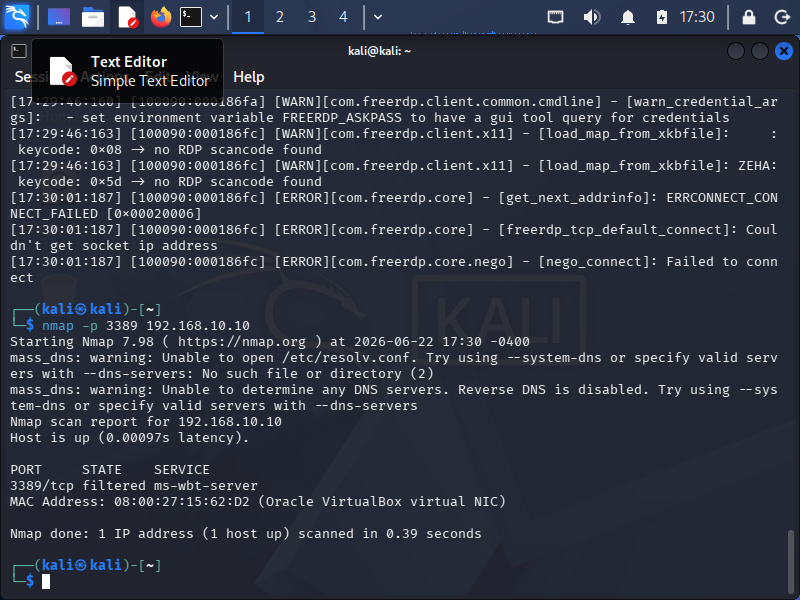
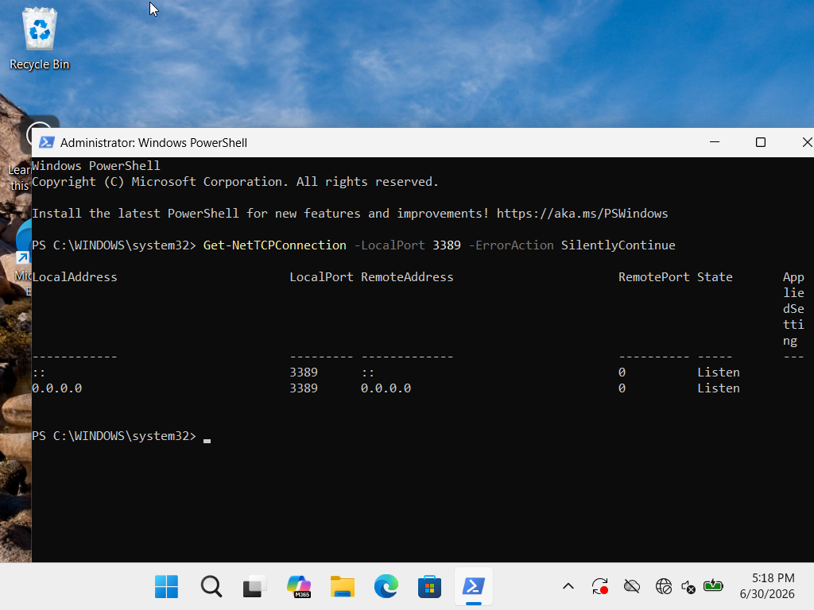
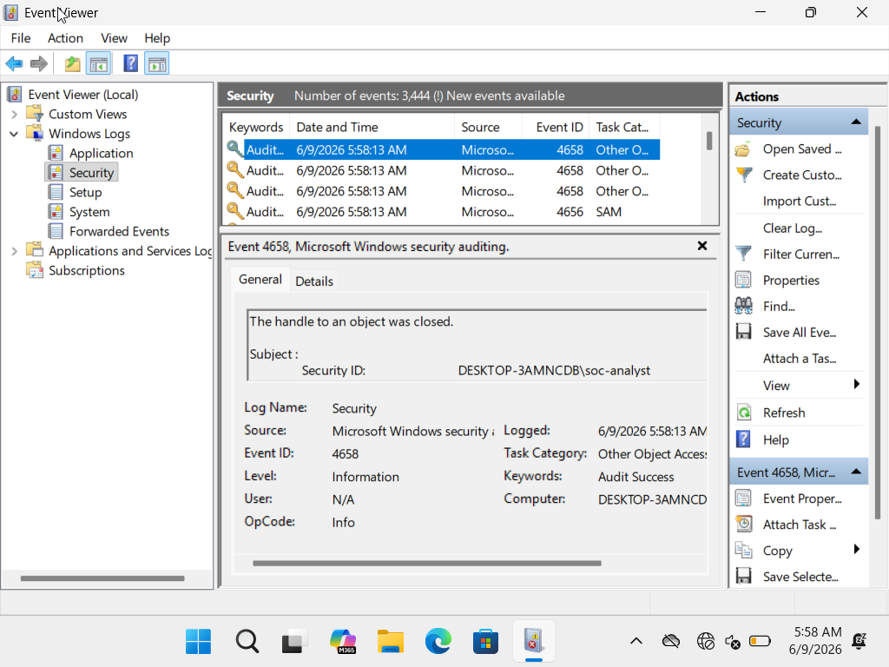
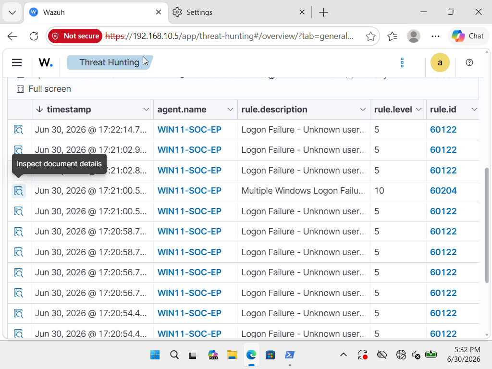
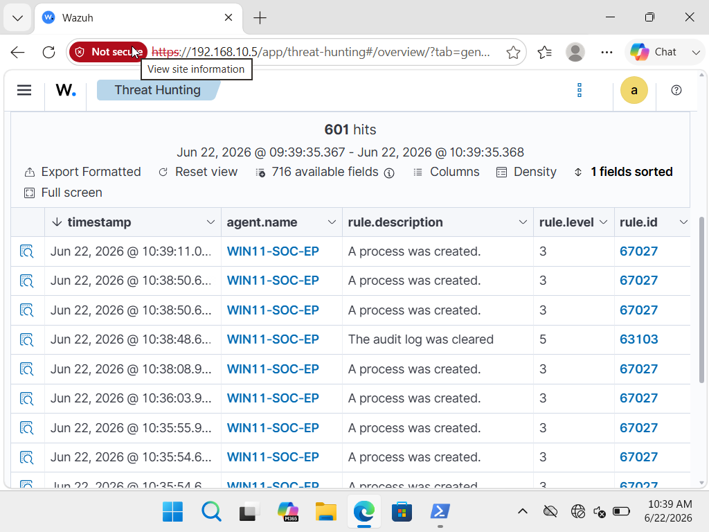

# Phase 3: Adversary Emulation, Detection Engineering & SOC Triage

## 1. Operational Objective & Threat Rationale

The objective of this phase was to simulate an external brute-force credential attack against exposed endpoint infrastructure, map the adversary's techniques to the **MITRE ATT&CK Framework**, and validate that the detection pipeline triggers high-fidelity alerts under high-velocity authentication stress.

* **MITRE ATT&CK Mapping:** [T1110.001 - Brute Force: Password Guessing](https://attack.mitre.org/techniques/T1110/001/)
* **The "Why":** Exposed administrative interfaces (such as RDP on port 3389) represent one of the most common initial access vectors for ransomware groups. A SOC analyst must be able to differentiate between single misconfiguration logon errors (benign) and distributed, automated credential spray/brute-force patterns (malicious).

---

## 2. Target Configuration & Port Remediation

### The Bottleneck: RDP Service Unreachable
During initial reconnaissance with Nmap from Kali Linux, port `3389/tcp` was reported as `closed` or `filtered`, causing initial connection drops.

```bash
# Reconnaissance scan from Kali Linux
nmap -p 3389 192.168.10.10
```


*Figure 3.1: Nmap scan showing RDP port 3389 not actively accepting connections.*

### System Remediation & Socket Validation
To establish the attack surface on the Windows 11 endpoint without disabling system defenses globally, RDP was surgically enabled and confirmed via PowerShell:

```powershell
# Enable Remote Desktop via Registry
Set-ItemProperty -Path 'HKLM:\System\CurrentControlSet\Control\Terminal Server' -Name "fDenyTSConnections" -Value 0

# Verify TCP 3389 is in a LISTENING state
Get-NetTCPConnection -LocalPort 3389 | Select-Object LocalAddress, LocalPort, State
```


*Figure 3.2: PowerShell output validating TCP 3389 is in an active LISTENING state.*

---

## 3. Adversary Emulation: Automated RDP Brute Force

With the service established, an automated dictionary attack was launched from the Kali adversary platform targeting the local analyst account.

```bash
# Executing RDP brute-force attack via Hydra
hydra -l soc_analyst -P /usr/share/wordlists/rockyou.txt rdp://192.168.10.10 -V -t 4
```


*Figure 3.3: Hydra executing rapid-fire credential attempts against the Windows 11 endpoint.*

---

## 4. Telemetry Correlation & SOC Analyst Triage

### Step 1: Endpoint Artifact Analysis (`Security.evtx`)
The high-velocity authentication failures generated explicit telemetry inside the local Windows Security event log.

* **Event ID 4625:** An account failed to log on.
* **Logon Type 10 (`RemoteInteractive`):** Confirmed the authentication vector was initiated remotely via Remote Desktop / Terminal Services rather than a local physical console (`Logon Type 2`) or network share (`Logon Type 3`).
* **Source Network Address:** `192.168.10.20` (Kali Linux node).


*Figure 3.4: Windows Security log confirming Event ID 4625 with Logon Type 10 and source IP.*

---

### Step 2: SIEM Rule Ingestion & Alert Escalation
The Wazuh Agent ingested the high volume of Event ID 4625 entries and forwarded them to the Wazuh Manager. The correlation engine aggregated the log stream and triggered a severity escalation based on threshold frequency.

* **Triggered Wazuh Rule:** `Rule 60122` (Multiple Windows Logon Failures - Potential Brute Force Attack).
* **Alert Severity:** Level 10 (High Priority).
* **Correlation Field:** Source IP `192.168.10.20` exceeding 8 failed logon events in under 30 seconds.


*Figure 3.5: Wazuh Dashboard displaying correlated brute-force alert aggregated from Event ID 4625 entries.*

---

## 5. Defense Evasion Simulation: Audit Log Tampering

To simulate post-exploitation defense evasion, an intentional attempt to clear the security event log was executed and triaged.

* **MITRE ATT&CK Mapping:** [T1070.001 - Indicator Removal: Clear Windows Event Logs](https://attack.mitre.org/techniques/T1070/001/)
* **Execution:**
  ```cmd
  wevtutil cl Security
  ```
* **Detection Rule:** `Wazuh Rule 63103` (Windows audit log was cleared).
* **Event Artifact:** Windows Security **Event ID 1102** (The audit log was cleared).


*Figure 3.6: Wazuh immediate high-severity detection upon security event log clearing.*

---

## 6. Phase 3 Operational Summary

| Phase Component | Artifact / Metric | SOC Analyst Interpretation |
| :--- | :--- | :--- |
| **Attack Vector** | `hydra rdp://` | Automated dictionary attack targeting Remote Desktop |
| **Endpoint Telemetry** | `Event ID 4625 / Logon Type 10` | High-frequency remote logon failures from an unauthorized IP |
| **Correlation Engine** | `Wazuh Rule 60122 (Level 10)` | Aggregated failed logon threshold breached; alerted as True Positive |
| **Defense Evasion** | `Wazuh Rule 63103 / Event ID 1102` | High-fidelity tamper alert triggered immediately upon log wipe |

**Key Takeaway:** Raw logs alone do not stop attacks—correlation rules that aggregate high-frequency authentication failures are critical to cutting through operational noise. Monitoring for administrative evasion techniques (like clearing event logs) ensures that even if an adversary gains initial access, their cleanup attempts generate immediate, high-priority alerts.
