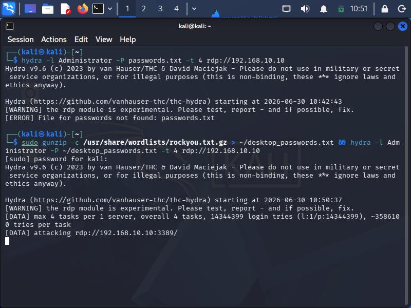

# Phase 3: Attack Emulation & Detection Triage

## 1. Objective (What & Why)
The objective of this phase was to simulate a real-world adversarial attack vector and verify if our centralized monitoring system could correlate and alert on the malicious activity. I executed an automated Remote Desktop Protocol (RDP) brute-force attack from the Kali Linux node against the Windows workstation to test the SIEM’s ability to detect brute-force thresholds.

---

## 2. Environment Setup & Troubleshooting (The Configuration)
* **Adversarial Tooling:** Hydra (FreeRDP module) configured to blast a list of common credentials.
* **Attacker Node (Kali Linux):** `192.168.10.20`
* **Target Node (Windows Endpoint):** `192.168.10.10`

### Port Remediation
During initial testing, connection failures occurred because RDP port `3389` was disabled at the OS level on the target. I performed targeted system remediation to open the port and verify its active listening state before proceeding with the attack.

---

## 3. Verification & Triage (The Proof)
Once the brute-force wave was executed, I verified the entire attack-to-detection pipeline inside the SIEM:

### Host-Level Log Generation
The Windows target successfully generated high-velocity security events tracking the failed attempts:
* **Event ID 4625:** An account failed to log on.
* **Logon Type 10:** RemoteInteractive (RDP authentication mechanism).

### SIEM Correlation & Alerting
Wazuh successfully ingested the raw logs. Once the velocity threshold was breached, the correlation engine upgraded the noise into a high-priority security alert:
* **Triggered Signature:** Rule 60122 (Multiple Windows Logon Failure).
* **Identified Source IP:** `192.168.10.20` (Kali Linux).

